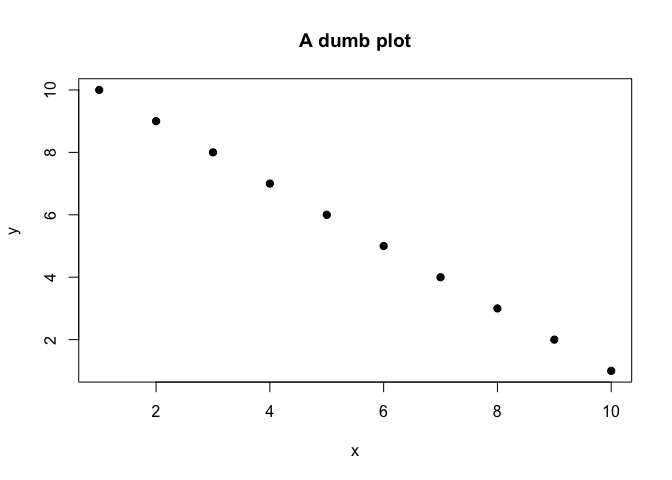

Untitled
================

# This is a section

This is some text that is going to exist in the section. This is going
to be replaced with an output.

``` r
x <- 1:10
y <- 10:1

plot(x, y, pch = 19, main = 'A dumb plot')
```

<!-- -->

And this is some more inline evaluation. The average of the `x-variable`
is 5.5.
