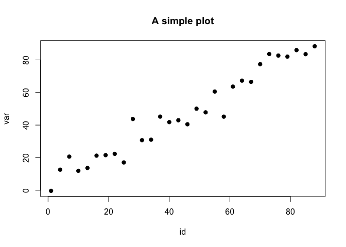

Problem Set 1
================

# Question 1

In this question, we’re asking you to hand-build some data. Create a
`data.frame` that has 30 rows and two columns. In the first column,
create an ID that covers each of the rows, iterating by 3. In the second
column, create a random draw from the normal distribution that has a
mean that is the value in the column just to the left of it.

``` r
d <- data.frame(
  id = seq(from = 1, by = 3, length.out = 30)
)
d$var <- rnorm(n = 30, mean = d$id, sd = 5)
```

We can actually plot this to show that things are, generally working.

``` r
with(d, plot(x = id, y = var, 
             main = "A simple plot",
             pch = 19)
     )
```

<!-- -->
